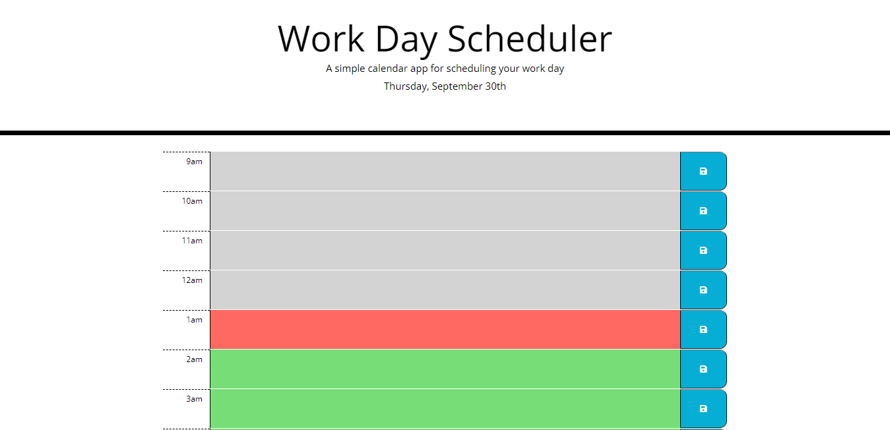

# Work Day Scheduler Starter Code

A website that allows a user to schedule tasks for their workday, and colors time slots based on their urgency. You can visit the page [here](https://robertareedy.github.io/code-quiz/).

